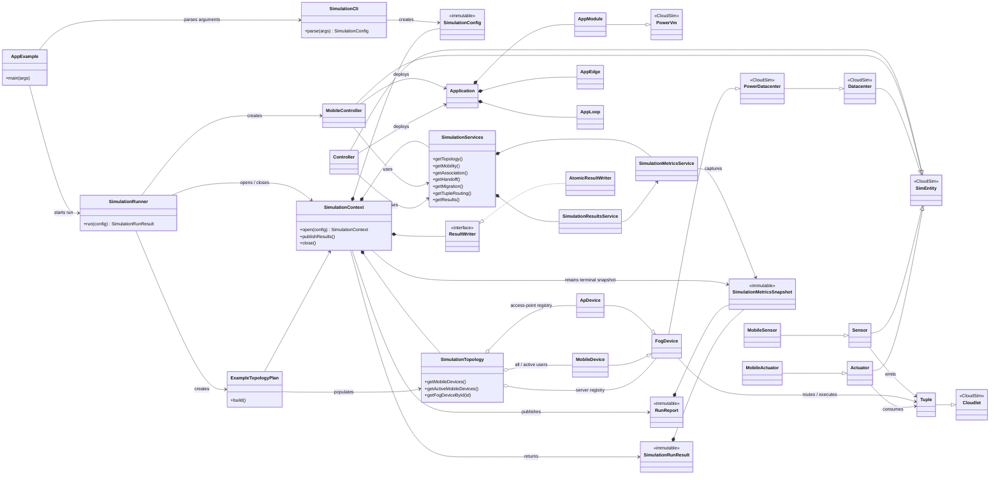
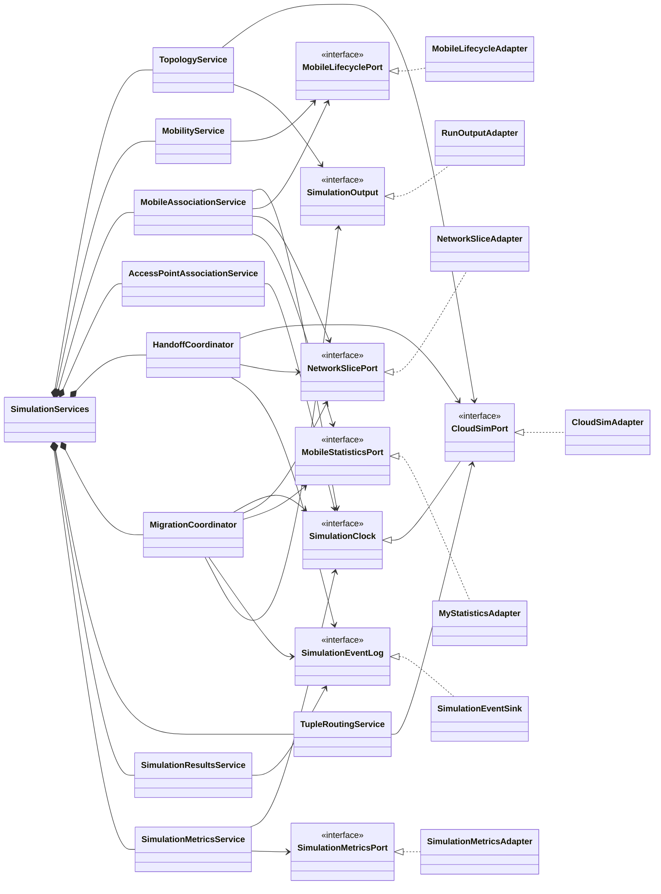
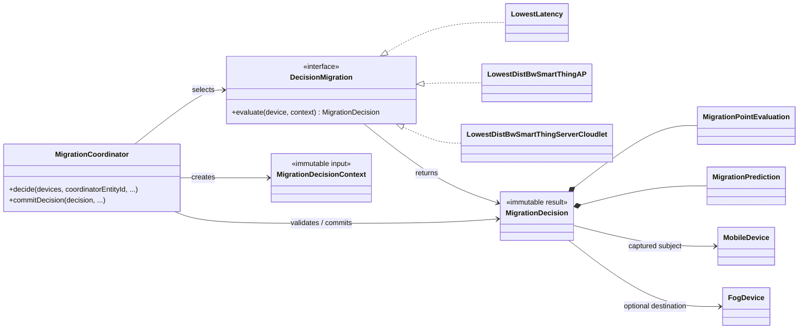
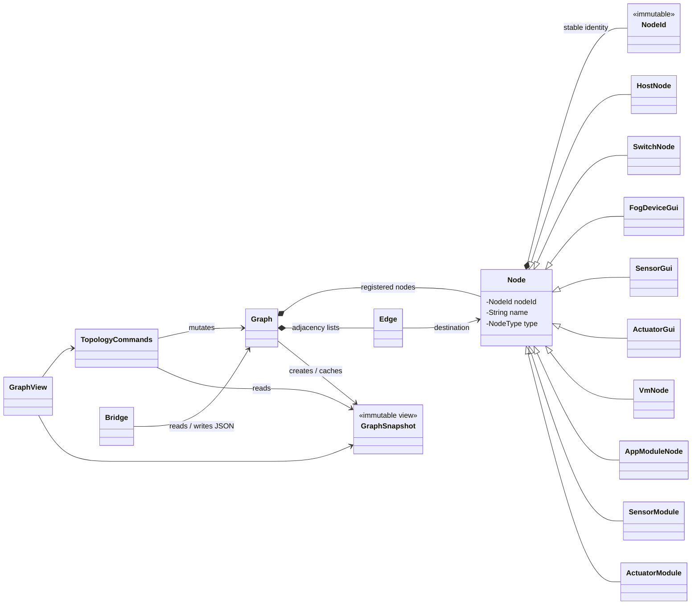

# MobFogSim overall architecture

This document describes the current production architecture of MobFogSim. It
focuses on ownership, runtime collaboration, and the main extension points
rather than listing every helper class. The diagrams use Mermaid and render in
GitHub and other Mermaid-aware Markdown viewers.

## Architectural style

MobFogSim is a discrete-event fog/mobile simulator built on CloudSim. The code
combines four architectural areas:

1. **Run orchestration** parses immutable configuration, opens one run-scoped
   context, builds the topology, starts CloudSim, and publishes the result.
2. **Domain services** implement mobility, association, handoff, migration,
   tuple routing, topology construction, and terminal metric capture.
3. **CloudSim entities** translate scheduled events into service calls and own
   the mutable state required while the event loop is running.
4. **GUI topology editing** uses a separate serializable graph model. It does
   not represent the live simulation registry.

The preferred dependency direction is from orchestration and entities toward
constructor-injected services, then toward narrow ports. Adapters isolate the
remaining CloudSim and legacy singleton APIs.

## Package responsibilities

| Package | Responsibility |
| --- | --- |
| `org.fog.vmmobile` | CLI parsing, run context, service composition, topology assembly, and run results |
| `org.fog.vmmobile.port` | Interfaces around the clock/event loop, lifecycle, metrics, network slicing, statistics, and output |
| `org.fog.vmmobile.adapter` | Production and legacy implementations of the ports |
| `org.fog.entities` | CloudSim entities, tuple routing, wireless association, and handoff execution |
| `org.fog.placement` | Controllers, module placement, mobility/association services, metrics, and reporting |
| `org.fog.vmmigration` | Migration decision strategies, immutable decisions, and migration transactions |
| `org.fog.application` | Application modules, tuple edges, monitored loops, and selectivity rules |
| `org.fog.utils` | Unit-bearing values, network slicing/accounting, event IDs, and shared factories |
| `org.fog.localization` | Coordinates, mobility samples/timelines, and distance calculations |
| `org.fog.gui.core` | Serializable editor graph, stable node identity, snapshots, commands, and JSON bridge |
| `org.fog.gui.dialog` / `org.fog.gui.example` | Swing editing dialogs and application shell |

## Runtime class diagram

This diagram shows the main ownership and collaboration paths. A filled diamond
means that the source owns the target for the duration of a run; an ordinary
arrow means that it invokes or references it.

## Run-scoped service graph

`SimulationServices` is the composition root for operational domain services.
Production runs obtain it from `SimulationContext`; compatibility constructors
fall back to `LegacySimulationAdapters` only when no context is active.

The service roles are deliberately narrow:

- `TopologyService` loads mobility and registers transport/AP/hierarchy links.
- `MobilityService` advances timestamped traces.
- `MobileAssociationService` owns mobile lifecycle and network association
  transactions.
- `AccessPointAssociationService` selects and reserves handoff capacity.
- `HandoffCoordinator` validates delayed events and commits or cancels a
  reservation.
- `MigrationCoordinator` evaluates pure migration strategies and commits an
  accepted decision transactionally.
- `TupleRoutingService` resolves tuple routes without owning entity event loops.
- `SimulationMetricsService` captures one immutable terminal snapshot;
  `SimulationResultsService` renders it.

## Migration decision model

Migration policy evaluation is separated from mutation. Strategies inspect a
`MigrationDecisionContext` and return an immutable `MigrationDecision`.
`MigrationCoordinator` checks that the captured source state is still current
before applying an accepted decision.

## GUI topology model

The editor graph is intentionally independent from `SimulationTopology`.
`NodeId` is immutable and is the sole basis of node equality and hashing;
display names may change only through the graph command boundary. Snapshots are
immutable structural views, and `Bridge` performs deterministic JSON I/O.

`AppModuleNode` in the diagram denotes `org.fog.gui.core.AppModule`; the alias
avoids confusing it with the runtime `org.fog.application.AppModule`.

## Runtime sequence

1. `AppExample` delegates argument handling to `SimulationCli` and execution to
   `SimulationRunner`.
2. `SimulationRunner` opens a `SimulationContext`. The context installs one
   run's clock, random streams, topology registry, service graph, metrics,
   output, and compatibility adapters.
3. `ExampleTopologyPlan` builds access points, server cloudlets, mobile devices,
   mobility traces, and transport links as a rollback-safe operation.
4. `MobileController` registers applications and drives mobility, association,
   handoff, and migration through `SimulationServices`. CloudSim entities
   continue to own event dispatch and device-local runtime state.
5. Sensors emit `Tuple` objects; fog/mobile devices route and execute them;
   actuators consume terminal tuples. Network slicing and accounting are
   applied at the relevant wired, wireless, and migration boundaries.
6. On terminal shutdown, the controller captures one
   `SimulationMetricsSnapshot`. The context writes a `RunReport`, constructs a
   `SimulationRunResult`, and detaches run-scoped compatibility state.

## Important invariants

- Only one `SimulationContext` may be active in a JVM because the underlying
  CloudSim runtime and some compatibility APIs remain static.
- The context owns mutable services and registries for exactly one run and must
  always be closed.
- `SimulationTopology.getMobileDevices()` is the archival all-user registry;
  `getActiveMobileDevices()` is the mutable participation view.
- Access-point, server, and mobile membership must be updated bidirectionally.
- Delayed handoff and migration events carry generation information so stale
  events cannot mutate a newer session.
- Migration strategies produce decisions; the coordinator alone commits them.
- Terminal metrics are captured once and shared by console rendering, reports,
  and programmatic results.
- Durations are milliseconds, data sizes are bytes, and data rates are bits per
  second unless an explicit boundary documents a conversion.
- GUI `Node` identity is independent of its display name, and topology JSON is
  serialized deterministically.

## Extension guidance

- Add a migration policy by implementing `DecisionMigration`; keep evaluation
  free of mutations and let `MigrationCoordinator` commit the result.
- Add an infrastructure integration behind a `port` interface and bind it in
  `SimulationServices` rather than calling another static API from entities.
- Add runtime topology mutations through `SimulationTopology` and the relevant
  lifecycle service so ordered registries and lookup indexes remain coherent.
- Add GUI mutations through `TopologyCommands`; never mutate collections from a
  `GraphSnapshot`.
- Add terminal outputs from `SimulationMetricsSnapshot` or `RunReport` so all
  consumers retain the same metric definitions.

## Architecture decisions

These records define cross-package simulation contracts that are easy to lose
when reading individual CloudSim entities. They describe the current model,
not every historical behaviour.

| Decision | Contract |
| --- | --- |
| [ADR-0001](decisions/0001-time-data-and-rate-units.md) | Time, data-size, and data-rate units |
| [ADR-0002](decisions/0002-topology-shape-and-ownership.md) | Physical topology shape and ownership |
| [ADR-0003](decisions/0003-network-contention-and-slicing.md) | Contention, queues, and network slicing |
| [ADR-0004](decisions/0004-mobile-user-retirement.md) | Terminal mobile-user retirement |
| [ADR-0005](decisions/0005-terminal-metric-definitions.md) | Terminal metric definitions |

An accepted decision changes only through a replacement ADR and corresponding
tests. `make lint` checks maintained Java sources with strict warnings, while
`make test` includes the deterministic semantic reference simulations.
